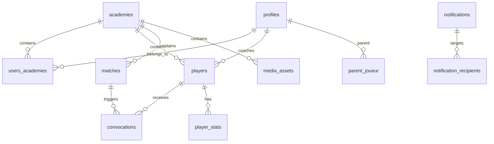

# Schéma de la base de données

## Diagramme ER

## Liste des tables

| Table | Description | RLS |
|-------|-------------|-----|
| `academies` | Entités multi-tenant | ✅ |
| `profiles` | Utilisateurs (lié à auth.users) | ✅ |
| `users_academies` | Junction multi-tenant | ✅ |
| `players` | Joueurs de l'académie | ✅ |
| `matches` | Matchs/entraînements | ✅ |
| `convocations` | Convocations joueurs | ✅ |
| `player_stats` | Statistiques individuelles | ✅ |
| `parent_joueur` | Relations parent-enfant | ✅ |
| `notifications` | Notifications système | ✅ |
| `notification_recipients` | Destinataires notifications | ✅ |
| `media_assets` | Fichiers uploadés | ✅ |
| `audit_logs` | Traçabilité actions | ✅ |
